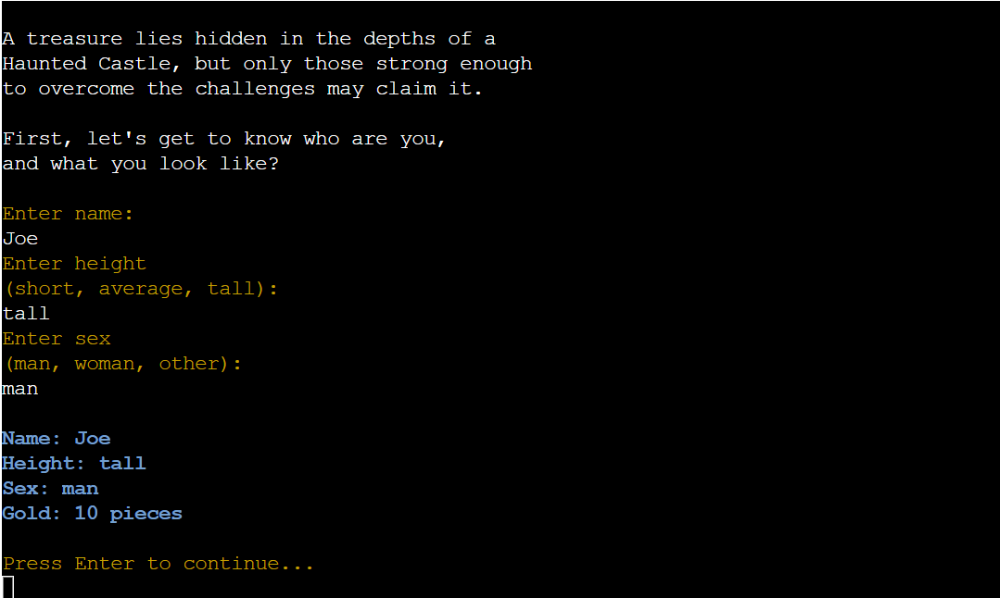

# Dungeons and Flaggons

Dungeons and Flaggons is a text based adventure game with a dab of roll play, a hint of gambling, and as many ales as you can stomach. With a focus on smooth, consistent flow the game allows users to traverse a small virtual world. Our hero, who is customisable to the user's preferences, is resting by the fire when a mysterious stranger comes to give them the call to adventure. It's a treachorous, dark journey but simultaneously silly and fun.

[Here is the live version of my project](https://text-adventure-ci-p3-8080b4434171.herokuapp.com/)

## The Five Planes of User Experience

- __The Strategy Plane__
  - Defining Goals and User Needs:
    - Our goal is to provide a fun and engaging terminal text-based-game that allows users to immerse themselves in a land of trolls bested by riddles, beast overlords who settle scores in rock-paper scissors and gambling tavern keepers.
    - The user wants a smooth demonstration of logical flow control, engaging dialogue, and text appearance, which we've aimed to achieve using colorama.
    - We also give users the opportunity to look back over previous runs of the game by sending their stats to a [google sheets page](https://docs.google.com/spreadsheets/d/1_FmMhmWtP10EMdpJXYXwIjeL_j1A50UksDBUsE7np2w/edit?gid=0#gid=0) using an API and installing GSPREAD functionality in our environment.

- __The Scope Plane__
  - Determining Features and Content:
    - We attempted to create distinct areas within the code for the user to experience something slightly different at each point. Each one incurring a different type of game / interaction.
    - There is a dice game, a coin flip, a riddles game and a game of rock paper scissors.
    - There is also potential for the hero to bribe another character, further incentivising the user to play the betting games.
    - The user can even make it more challenging for themselves if they wish by drinking ale, thereby doubling their minimum bet due to their hero's newfound Dutch courage.

- __The Structure Plane__
  - Setting the Sitemap:
    - Obviously less relevant in the case of a terminal based project, but a lot of time went into considering how each block of text would appear in the terminal and how it would affect the user experience.
    - Generally we attempted to never print a block of text taller vertically than the height of the terminal, and for any longer pieces of dialogue we split them up with the click enter to continue function. This greatly improved pacing, user interaction, increased the suspense and generally just made the terminal data easier to consume.

- __The Skeleton Plane__
  - The layout and navigation plans below were crucial to the success of this project. There are a couple of noteable exceptions to the flow in the initial diagram such as replaying the game with the same character taking the user to the tavern, and users without enough gold to bribe being offered the chance to go back to the tavern to earn more. The below, particularly the flow diagram was undoubtedly the skeleton of this project.

  

  - Below is the more simplistic flow I started with before creating the diagram. Note the features unticked at the bottom that I hope to implement in the future.

  

- __The Surface Plane__
  - The Visual Design:
    - Again the surface plane is of course less relevant for terminal projects, but as mentioned above, thought went into the volume of content, the spacing and the colour too.
    - Using Colorama with specific imports of Fore, Back and Style we were able to add a little bit more character to the text. As much as possible each character was associated with a particular colour, the smelly troll a luminescent green, and the big bad Beast Lord a deep bold red for example.

## Features

- __Intro Section and The Call to Adventure__
  - Player creation:
    - The user gets to choose their character's name, sex and height, once successfully completed the player object is created and is passed from function to function throughout the rest of the game.
    - Their brave character then has the archetypal, if admittedly cliche, Call to Adventure to begin their hero's journey, or whimsical early game-over if they choose to keep relaxing by the fire and decline the call.

  

- __The Tavern__
  - Array of options:
    - After a rowdy introduction to the tavern keeper, who the user encounters as he's throwing a drunkard out of the tavern just before he chooses to insult the user based on their chosen height, the user enters the tavern and is given an array of options to choose from.

  

  - Drinking, eavesdropping, and Irish goodbyes:
    - The user can help themselves to a refreshing ale, as long as they don't mind the room spinning a bit, that increases their dutch courage and the minimum amount their character will bet on the tavern games. They can eavesdrop on their fellow tavern patrons for information on a way into the castle - there is a clue in what the user finds that encourages alternate approaches to play - then once the hero has that information they can head for the castle.

  - Gambling on coins and die:
    - The user can try their luck at some tavern games. What you stake is what you get and what you stand to lose. Your minimum bet doubles every time you drink an ale and your maximum bet is your total gold. House rules are that even a draw on the dice roll is a win for the tavern keeper so the dice is less likely to go the player's way, the coin flip is more forgiving.

  

- __The Guard__
  - The Bribe:
    - Valiantly protecting the castle gate is your friendly neighbourhood guard. Only in this case the guard is as friendly as a box of wasps and his only sincere interest in your interaction, apart from his brief, harrowing attempt at flirtation if you choose to play as a woman, is extorting you out of your hard earned gold.
    - If you have the steep price of entry you can waltz straight through to the finale and face the final boss, skipping the interaction with the troll altogether. Otherwise, you can hold your head high, reject his request for a bribe, even though you have the money, just to prove an upstanding citizen of Pythonia such as yourself wouldn't sully their reputation over such things.

  - Return to the Tavern:
    - Much more likely than the above scenario is that you won't have the gold pieces requried to bribe the guard. Fret not though, at this point, as long as you have more than zero gold - see below - you're offered the opportunity to head back to the tavern to try and build up enough gold to bribe the guard.
    - On the other hand, if you're really down on your luck and do in fact have no gold whatsoever, your interaction with the guard will be solely abuse unfortunately. You suffer through one line of insulting / sarky dialogue to the next only to be embarrassed for want of gold and shuffled through to the secret passage sequence with no alternative.

  

- __The Secret Passageway__
  - J.R.R Trollkein:
    - In another comforting adventure classic, the hero finds the secret passageway into the castle, only to realise the keeper of this path is a terrifying troll who happens to love riddles.
    - The premise is simple, guess more riddles correctly than incorrectly and the troll will let you proceed, fail to do this and the troll will gobble you up in one mouthful.

  

- __The Beast Lord__
  - Rock-paper-scissors... To the death:
    - The Beast Lord is our very arch arch-villain, a cruel despot who makes life hard for the people and hoards all the wealth. Fortunately, this demonic being's method of combat is rock-paper-scissors, so at least we should all know the rules. After, and also before depending on whether you defeat the Beast Lord, a very dramatic speech you face the Beast Lord in a life and death winner takes all battle of rock-paper-scissors.
    - The game includes a turn counter that increases for every valid round played including draws, this is helpful as the repetitive nature of the game can make it easy to lose track of the fast-moving text.

  

- __Game Over Features__
  - Restart Game:
    - There are a few potential outcomes in game, such as death by troll ingestion, or getting a soul removed during high-stakes rock-paper-scissors, that incur a game over.
    - At this point the user will be asked if they want to play again. If they say no, the program ends and we thank them for playing. If they say yes, we then offer the user the chance to play with the same hero they most recently created. If they say yes to that they'll add one to their restarts stat - see below - and begin play from the tavern. If they say they want an entirely new character they'll begin all the way back at the intro.

  

  - Endgame Stats:
    - Throughout the game, the program will be tracking player actions in the background. So when the player eventually reaches a game over they see a print of all their deeds.
    - On this same screen is the URL for the [adventurer Google sheet](https://docs.google.com/spreadsheets/d/1_FmMhmWtP10EMdpJXYXwIjeL_j1A50UksDBUsE7np2w/edit?gid=0#gid=0) tied to the project via API. Here, the user can see all the previous characters created and how each one of them fared.

  

### Future Features
    - Better returns for players who win on dice bets
    - Bigger roster of riddles
    - Command users can use to check their gold amount
    - Command users can use to quit/restart game mid-session

## Bugs

    - OUTSTANDING// Occassionally an error will come through when the program is initiated, API related, the console will say 'wait thirty seconds and run it again'. Seems to be an issue on the Google Server, out of scope for this project to fix.
    - FIXED// Call to adventure being called twice in case of restart with same character - Removed the redundant call to call_to_adventure in restart_game when restarting with the same character. Ensured intro() only calls call_to_adventure on new character creation.
    - FIXED// NoneType exception occurring between the intro and call_to_adventure methods. Return of 'player' added to intro function
    - FIXED// Bet maximum validation updated to ensure user can't bet if their gold is less than their minimum bet.
    - FIXED// Game over loop issue was affecting the guard interaction, specifically if the user restarted with the same character, had enough gold to bribe the guard and made an incorrect input when asked to decide whether they wanted to go through with the bribe. Guard interaction vaildations all put within while loops to correct.

## Testing

To the best of the developer's knowledge and ability every feature and possible user input and required validation has been tested for as per the below file.

[Test Script](test-script.md)

### Validator Testing

PEP8 online's validator didn't appear to be available when I attempted to use the site. Instead I've opted for the inbuilt flake8 command which does a comprehensive PEP8 check of all in-scope code within the project. As per the below screenshot the only items flagging in it are from files built in to the Git CI template, none of which are written by the dev of this project.

[PEP8 Check](assets/images/pep8-check.png)

  - Side note:
    PEP8's standards, particularly in relation to the number of characters per line of code, are not conducive to this print heavy style of project.
    For a version of the project optimised for 80 characters worth of output per line visible in the user terminal, rather than 79 characters per line of code including indent, we'd recommend running the below:
    [80 Character Terminal Width Version](https://github.com/JDonnellyCodeInstitute/text-based-adventure/commit/8bea18275d3218353a0b5ad5de34585ec0d918c5)

## Deployment

This project was deployed using Code Institute's mock terminal for Heroku.

  - Steps for deployment:
    - Fork or clone this repository
    - Create a new Heroku app
    - Set the buildbacks to Python and NodeJS in that order
    - Link the Heroku app to the repository including config var inputs
    - Click on Deploy

## Credits

    - RPS Guidance: https://www.youtube.com/watch?v=fn68QNcatfo
    - Set-up for API: Code Institute Love Sandwiches project
    - Deployment information: Code Institute Project 3 example README
